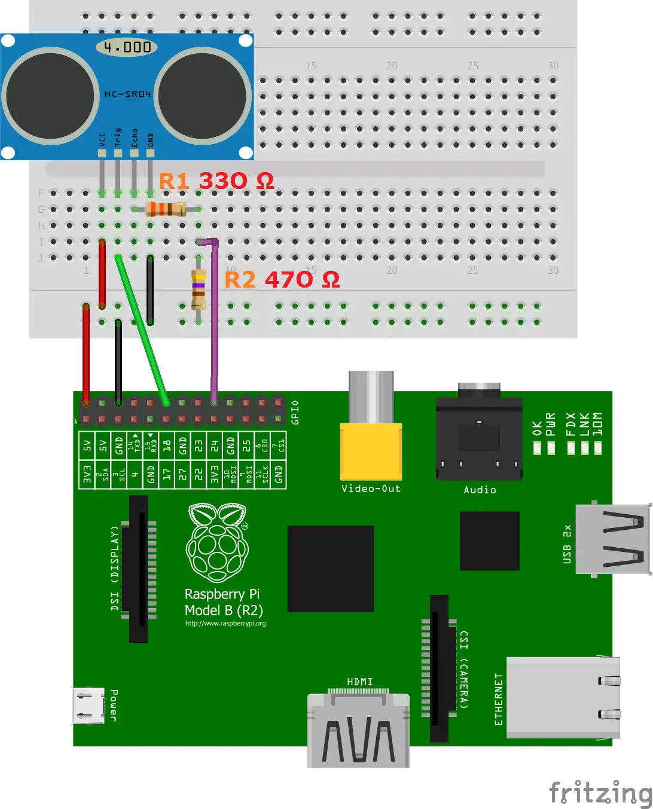
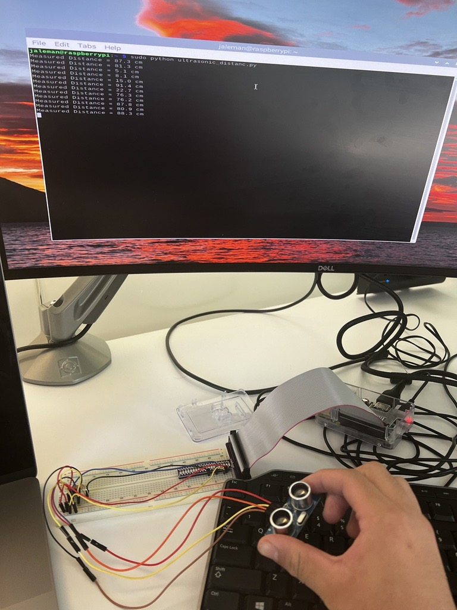

# Raspberry Pi Ultrasonic Sensor Setup Guide

This guide is intended to help  set up and use an ultrasonic sensor (HC-SR04) with your Raspberry Pi. Ultrasonic sensors are for distance measurement and detection. 

## Components Needed:

- Raspberry Pi (has to be up to date)
- Ribbon Cable
- Breadboard
- HC-SR04 Ultrasonic Sensor Module
- Resistors: 330Ω and 470Ω
- Jumper Wires

## Wiring:

Connect the ultrasonic sensor to the Raspberry Pi as follows:

1. **VCC**: Connect this pin on the sensor to **Pin 2 (VCC)** on the Raspberry Pi.
2. **GND**: Connect this pin on the sensor to **Pin 6 (GND)** on the Raspberry Pi.
3. **TRIG**: Connect this pin on the sensor to **Pin 12 (GPIO18)** on the Raspberry Pi.
4. **ECHO**: Connect this pin on the sensor to a 330Ω resistor. Connect the other end of the resistor to **Pin 18 (GPIO24)** on the Raspberry Pi. Also, connect this pin through a 470Ω resistor to **Pin 6 (GND)** on the Raspberry Pi.

## Wiring Image



## Coding:

1. Create a Python file for the code:

```bash
sudo nano ultrasonic_distance.py
```

2. Copy and paste the following code into the nano text editor:

```python
# Import necessary libraries
import RPi.GPIO as GPIO
import time

# Set the GPIO mode to BCM 
GPIO.setmode(GPIO.BCM)

# Define the GPIO pins for the ultrasonic sensor
GPIO_TRIGGER = 18  # Pin to trigger the ultrasonic sensor
GPIO_ECHO = 24     # Pin to receive the ultrasonic sensor's echo

# Set the GPIO pins as either input or output
GPIO.setup(GPIO_TRIGGER, GPIO.OUT)
GPIO.setup(GPIO_ECHO, GPIO.IN)

# Function to measure distance
def distance():
    # Send a short pulse to trigger the ultrasonic sensor
    GPIO.output(GPIO_TRIGGER, True)
    time.sleep(0.00001)
    GPIO.output(GPIO_TRIGGER, False)

    # Record the time when the ultrasonic sensor's echo is received
    StartTime = time.time()
    StopTime = time.time()

    # Wait for the echo to be received
    while GPIO.input(GPIO_ECHO) == 0:
        StartTime = time.time()

    while GPIO.input(GPIO_ECHO) == 1:
        StopTime = time.time()

    # Calculate the time taken for the echo
    TimeElapsed = StopTime - StartTime

    # Calculate distance based on the speed of sound (34300 cm/s)
    # Divide by 2 because the sound goes to the object and back
    distance = (TimeElapsed * 34300) / 2

    return distance

# Main program
if __name__ == '__main__':
    try:
        while True:
            # Call the distance function to measure distance
            dist = distance()
            
            # Print the measured distance in centimeters
            print("Measured Distance = %.1f cm" % dist)
            
            # Wait for 1 second before taking the next measurement
            time.sleep(1)

    # Handle Ctrl+C keyboard interrupt gracefully
    except KeyboardInterrupt:
        print("Measurement stopped by User")
        
        # Clean up GPIO pins before exiting
        GPIO.cleanup()
```

3. To save the file, press **Ctrl + O** (or Command + O on Mac), then press **Enter**. To exit nano, press **Ctrl + X** (or Command + X on Mac).

4. Run the Python script:

```bash
sudo python ultrasonic_distance.py
```
## Results!




## Issues I Had (Learn from My Mistakes):

- **Resistor Values:** I had a tough time finding the correct resistor values. In my first attempt, I  used a 1K resistor instead of a 470Ω resistor because I didn't have any 470Ω resistors. I figured, "Bigger is better, right?" Wrong. My sensor just didn't perform as expected. Lesson learned: stick to the intended resistor value.

- **Twisted Ribbon Cable:** I faced another issue where I had the ribbon cable all twisted up. This meant that the wires weren't making solid connections, and my sensor refused to connect. It turns out, untwisting things can make your project go much smoother.

- **Color Coding:** Just a tip: keep those jumper wire colors organized. Red means power, black means ground, and it turns out that following this rule isn't just for neatness; it can save your sensor from getting fried (like i did LOL).
